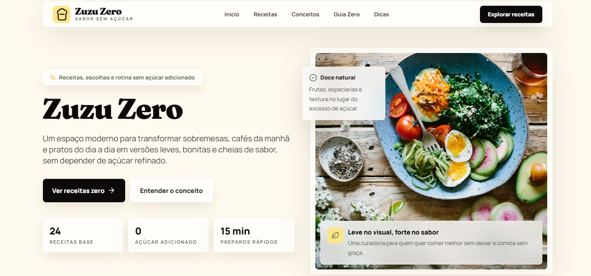

<h1 align="center"> Site-ZuZu</h1>

<p align="center">
  
  
  
  
  
  
</p>

<p align="center">
  Um site de cardápio digital e identidade visual para o restaurante fictício <strong>ZuZu</strong>, construído para explorar React com TypeScript e integração com Supabase.
</p>

---

##  Preview

<p align="center">
  
</p>

---

##  Por que esse projeto existe?

Esse repositório nasceu como um laboratório pessoal para praticar:

- Criação de interfaces com React + TypeScript
- Gerenciamento de estado e hooks
- Integração com banco de dados serverless (Supabase)
- Organização de componentes e estilização com CSS puro

A ideia foi transformar um design conceito de restaurante em algo funcional, com direito a seções reutilizáveis e um back-end simples para gerenciar receitas.

---

##  O que o site entrega

- **Hero Section** — Identidade visual forte, com chamada principal
- **Conceitos** — Diferenciais da casa (qualidade, sabor, ambiente)
- **Receitas** — Grade de pratos com nome, descrição e imagem
- **Guia Zero** — Seção especial para restrições alimentares (glúten, lactose, etc.)
- **Integração com Supabase** — Dados dinâmicos de receitas e conceitos
- **Design responsivo** — Funciona bem em celular, tablet e desktop

---

##  Stack utilizada

| Tecnologia  | Uso principal                  |
| ----------- | ------------------------------ |
| React 18    | Construção da UI               |
| TypeScript  | Tipagem e segurança no código  |
| Vite        | Bundler e dev server rápido    |
| CSS         | Estilização dos componentes    |
| Supabase    | Back-end e banco de dados      |
| Git/GitHub  | Versionamento e deploy (futuro)|

---

##  Rodando localmente

### Pré-requisitos

- [Node.js](https://nodejs.org/) (v16 ou superior)
- [npm](https://www.npmjs.com/) ou [yarn](https://yarnpkg.com/)
- Uma conta gratuita no [Supabase](https://supabase.com/) (para obter as credenciais)

### Passo a passo:

```bash
# 1. Clone o projeto
git clone https://github.com/Gsilva-Vs/Site-ZuZu.git

# 2. Entre na pasta
cd Site-ZuZu

# 3. Instale as dependências
npm install

# 4. Configure as variáveis de ambiente
cp .env.example .env   # Depois edite o .env com seus dados do Supabase

# 5. Rode o servidor de desenvolvimento
npm run dev
